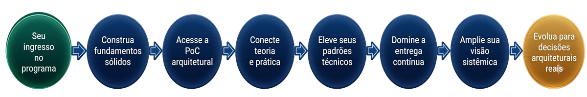
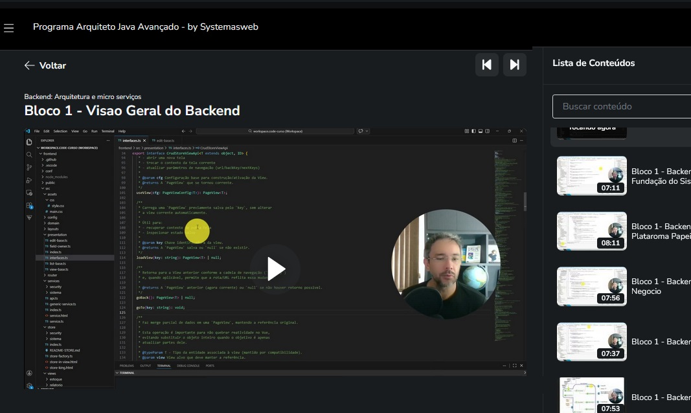
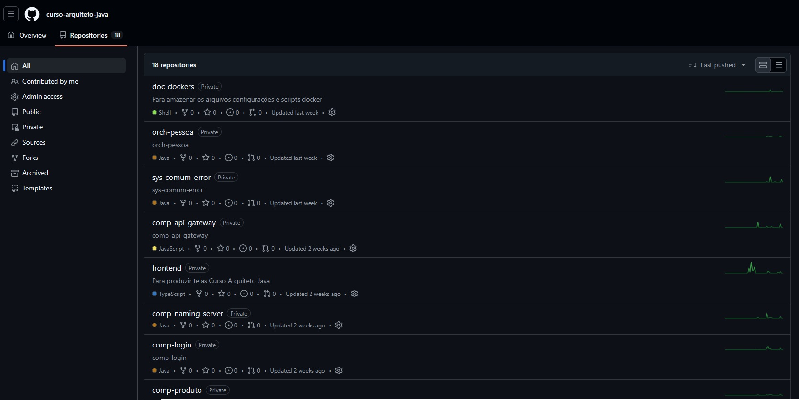
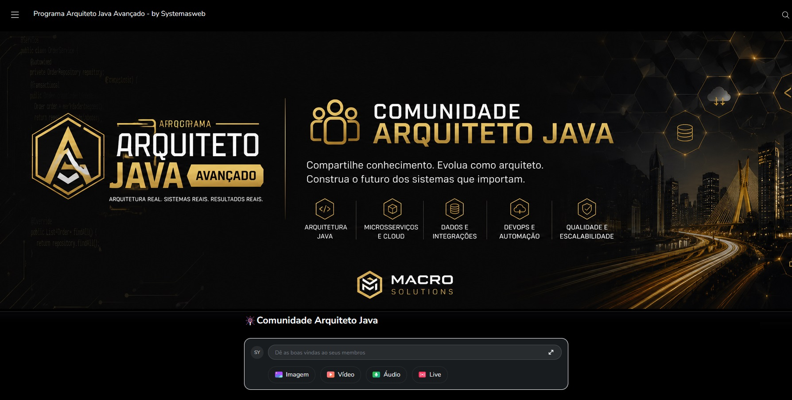

  

# Laboratório Arquitetural

Conheça a experiência prática do **Programa Arquiteto Java Avançado**.

Este repositório apresenta como é a jornada do aluno ao longo da formação, evidenciando a combinação entre aulas em vídeo, demonstrações práticas, utilização da PoC arquitetural, recursos complementares, comunidade ativa e acompanhamento durante os primeiros 90 dias.

O objetivo é mostrar como teoria e prática se conectam para apoiar a evolução de profissionais experientes rumo a decisões arquiteturais reais.

---

## Como é a jornada do aluno?

  

Ao ingressar no programa, o aluno percorre uma jornada estruturada que combina conceitos arquiteturais, prática orientada e recursos complementares para apoiar sua evolução profissional.

---

## Aulas práticas e demonstrações

  

As aulas foram concebidas para integrar fundamentos, reflexões arquiteturais e demonstrações práticas, permitindo compreender não apenas o "como fazer", mas também o "porquê" das decisões técnicas adotadas.

---

## PoC em ação

  

Ao longo da formação, conceitos apresentados nas aulas são observados em contexto por meio de uma PoC educacional, aproximando o aprendizado de cenários encontrados em ambientes corporativos.

---

## Recursos complementares

  

Além das aulas, o programa utiliza recursos complementares que contribuem para a construção do pensamento arquitetural e apoiam a jornada de aprendizagem do aluno.

---

## Comunidade e acompanhamento

  

Os alunos contam com uma comunidade ativa dentro da plataforma Hotmart e com acompanhamento durante os primeiros 90 dias, criando um ambiente favorável à troca de experiências e ao esclarecimento de dúvidas relacionadas ao conteúdo do programa.

---

## Uma experiência estruturada de evolução

Mais do que consumir vídeos, o aluno vivencia uma jornada planejada para conectar conceitos, prática e reflexão arquitetural.

A proposta do laboratório é apoiar a transição da implementação para decisões arquiteturais mais conscientes, ampliando a visão sistêmica e fortalecendo a capacidade de análise técnica ao longo da carreira.

---

## Conheça o Programa Arquiteto Java Avançado

🌐 <a href="https://programa.systemasweb.com.br">Programa Arquiteto Java Avançado</a>

➡️ <a href="https://github.com/MarceloPF">Github MarceloPF</a>

💼 <a href="https://www.linkedin.com/in/marcelopf">LinkedIn</a>

---

## Dúvidas sobre o programa?

  

Fale diretamente comigo pelo WhatsApp Business e tire suas dúvidas sobre o programa antes de realizar sua inscrição.

---

## Sobre o autor

Desenvolvido e mantido por **Marcelo Ferreira**, Arquiteto de Software, fundador da **Systemasweb** e criador do **Programa Arquiteto Java Avançado**.

Com mais de **17 anos de experiência**, atua na construção, evolução e sustentação de sistemas corporativos, compartilhando ao longo desta formação experiências práticas adquiridas em projetos reais.

➡️ <a href="https://github.com/MarceloPF">Github MarceloPF</a>